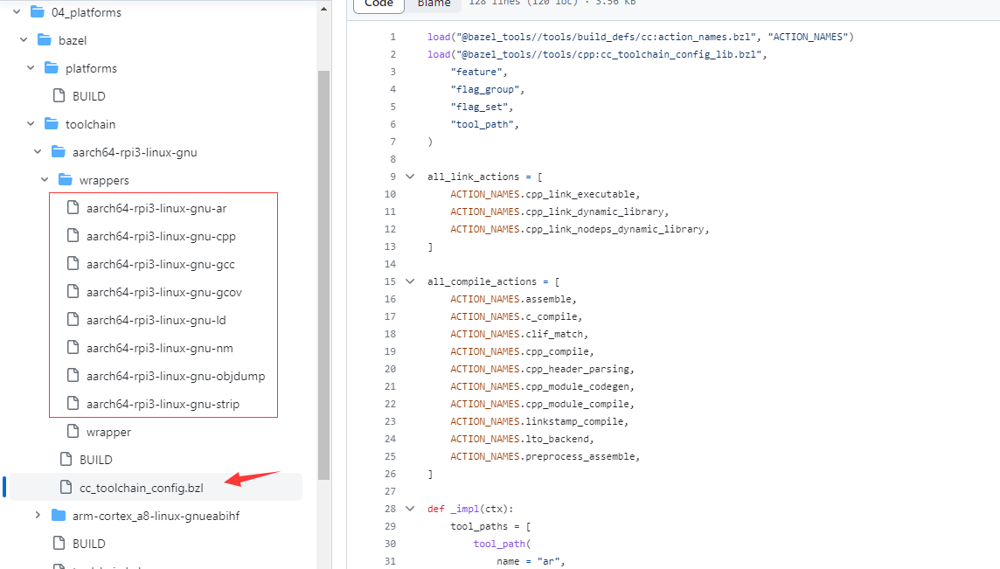

# 核心基础概念

### 引言

这部分实际上会针对性地重点讲一下最常用的术语，和最常见的问题。这里的概念很多都是剥离了语言层面，只关注通用领域。

我建议大家直接阅读以下链接，来获取一手消息

[https://blog.aspect.dev/avoid-eager-fetches](https://blog.aspect.dev/avoid-eager-fetches)


### 为什么我要阅读这一页？

Bazel体系的用户经常遇到的错误都是比较"简单”的错误，往往是对核心概念理解不到位导致。我推荐bazel的研发用户阅读这一章，避免出现问题。


### 核心基础术语

介绍术语之前，先看看bazel的一次执行过程，都有什么阶段？

1. **Loading Phase**: Bazel会加载工作目录里面的 BUILD文件，解析这些文件的内容来创建创建package和target graph。此阶段涉及评估宏、从glob到具体文件的映射关系（因为bazel支持glob，就那个什么\*\*/\*.txt的语法）和解析target之间的依赖关系。
   1.  需要注意的是，如果在workspace里面写了一些外部依赖的命令，那么在LOAD阶段就会直接下载这些外部依赖，比方说下面的写在WORKSPACE里面的代码，一旦开始做构建，就会去下载对应的依赖（即使这些依赖目前并不需要），这个可能会导致bazel eager fetch的问题

       ```python
       load("@rules_python//python:pip.bzl", "pip_parse")

       pip_parse(
          name = "my_deps",
          requirements_lock = "//path/to:requirements_lock.txt",
       )

       load("@my_deps//:requirements.bzl", "install_deps")
       install_deps()
       ```
2. **Analysis Phase**: Bazel分析目标图，确定构建所需的操作步骤。它会检查目标的依赖项或源文件是否发生了变化，以确定是否需要重新构建。在此阶段，Bazel创建一个操作图，表示生成所需输出的构建步骤的顺序。
   1.  这里依然存在bazel eager fetch的问题，因为在BUILD文件里面同样包含Load语句，看下面的例子，只要需要涉及构建到这个对应BUILD文件，或者说这个package的某个target，就会引入npm的拉取

       ```python
       # Content of //pkg1:BUILD
       load("@npm//@bazel/typescript:index.bzl", "ts_project")

       package(default_visibility = ["//visibility:public"])

       ts_project(
           name = "a",
           srcs = glob(["*.ts"]),
           declaration = True,
           tsconfig = "//:tsconfig.json",
           deps = [
               "@npm//@types/node",
               "@npm//tslib",
           ],
       )

       filegroup(name = "b")
       ```
3. **Execution Phase**: Bazel执行action graph中的操作（这里注意，不是target graph），以构建目标。该阶段涉及调用编译器、链接器和其他构建所需的工具。Bazel会尽可能并行执行这些操作，利用可用资源加快构建过程。
4. **Output Generation**: 随着操作的执行，Bazel生成目标指定的输出文件。这些文件可以是二进制可执行文件、库文件、测试结果或在BUILD文件中定义的其他构建产物。
5. **Caching and Incremental Build**: Bazel利用缓存机制来提高构建性能。它会缓存先前构建的结果，并使用它们来避免重新执行未更改的操作。这种增量构建的特性使得Bazel只需重新构建项目中必要的部分，节省时间和资源。
   1. 注意，bazel的["repository cache"](https://bazel.build/docs/build#repository-cache) 是不会缓存外部依赖的，如果外部依赖的下载规则里面有sha256 的hash它才会缓存，否则就是很简单的cvs拉取
6. **Build Success or Failure**: 构建结束啦，这个时候如果是编译就是输出具体文件的路径，如果测试（成功）就是成功了，没啥别的信息

下面的术语，我会把影响到的阶段也一并列出

#### LABEL

loading phase，analysis phase

所有target都属于一个包。目标的名称称为其标签。每个标签都唯一标识一个目标。一般来说推荐提供完整路径用来标识特定的target，比方说下面的例子，第一部分是仓库名字`@myrepo//`. 因为大部分代码都是同样代码库，所以可以直接写//，省略最前面的代码库。标签第二部分表示package 名字， `my/app/main` 用路径来表示。我推荐用户使用完整的路径来标识target，而不是相对地方式，来避免问题

```
@myrepo//my/app/main:app_binary
```


#### BUILD 文件 <a href="#build-file" id="build-file"></a>

loading phase，analysis phase

一般研发平时需要写的都是BUILD文件，简单来说就是如何定义Package。Build是Bazel的主要配置文件，用于告诉Bazel要构建哪些软件输出，它们的依赖关系是什么，以及如何构建它们。

大多数构建规则都依托于具体的语言，比方说cc\_binary、cc\_library和cc\_test分别是用于构建C++二进制文件、库和测试的构建规则。其他编程语言使用相同的命名方案，只是前缀不同，例如Java的规则以java\_\*开头。

bazel的规则一部分是native支持，另一部分就是拓展方式支持，因为bazel的拓展大部分命名为 `.bzl`格式，因此使用类似下面的语句来加载规则

```
load("//foo/bar:file.bzl", "some_library")
```


Bazel的规则分类

*   `*_binary`规则用于构建特定语言的可执行程序。在构建完成后，可执行文件将位于构建工具的输出目录里面中，路径与规则的标签相对应。例如，//my:program将出现在二进制输出树的$(BINDIR)/my/program路径下，bazel会明确地输出编译出来的文件的路径，参考下图

    在某些语言中，这些规则还会创建一个runfiles目录，其中包含属于该规则的data属性中提到的所有文件，或者依赖项的传递闭包中的任何规则所提到的文件。这些文件集合会集中在一个位置，方便部署到生产环境中。
*   `*_test`_规则是_\_binary规则的一种特殊形式，用于自动化测试。测试只是在成功时返回零的程序，**所以不要再问，为什么我的测试程序成功了，但是没看到日志呀？**

    与二进制文件一样，测试也有runfiles目录，其中的文件是测试在运行时合法打开的唯一文件。例如，一个名为cc\_test(name='x', data=\['//foo:bar'])的程序在执行过程中可以打开和读取$TEST\_SRCDIR/workspace/foo/bar。（每种编程语言都有自己的实用函数用于访问$TEST\_SRCDIR的值，但它们都等同于直接使用环境变量。）如果违反此规则，当在远程测试主机上执行测试时，测试将失败。**runfiles目录对应于BUILD文件中明确指定的可见性**
* `*_library`规则用于指定在给定编程语言中单独编译的模块。库可以依赖其他库，而`*_binary`和`*_test`可以依赖库。


#### Dependencies

loading phase，analysis phase

在写BUILD的时候，真正要解决的问题往往是依赖关系的修正，正常情况下，如果你依赖了什么东西，你就应该直接添加到deps或者data里面。而不是让自己依赖的组件来提供这种依赖，参考下面的例子


`a`直接依赖`c`，但忘记在构建文件中声明它时， 就会引入潜在风险。

| `a / a.in`                                                                                               |                                                                                                  |
| -------------------------------------------------------------------------------------------------------- | ------------------------------------------------------------------------------------------------ |
| <pre><code>        import b;
        import c;
        b.foo();
        c.garply();
      
</code></pre> |                                                                                                  |
|            |  |

声明的依赖关系不再符合实际的依赖关系。这可能构建正常，因为依赖关系被闭包封锁了的，但掩盖了一个问题：`a`直接依赖`c`。


大多数构建规则都具有三个属性，用于指定不同类型的通用依赖项：`srcs`、`deps`和`data`。下面对此进行解释。有关更多详细信息，请参阅 [所有规则通用的属性](https://bazel.build/reference/be/common-definitions)。

这几种依赖关系提供不同的功能

1. src依赖：由输出源文件的一个或多个规则直接使用的文件。
2. deps依赖：指向提供头文件、符号、库、数据等的单独编译模块的规则。
3. data依赖：比方说test或者binary需要数据文件，编译单元测试时，不需要该文件，但在运行测试时确实需要它。这同样适用于在执行期间启动的工具。这种文件一般加在data里面，因为构建系统在一个隔离目录中运行测试（实际上就是沙盒），其中只有列出的文件 `data`可用。因此，如果二进制/库/测试需要运行一些文件，请在`data`.里面加这些东西

```
# I need a config file from a directory named env:
java_binary(
    name = "setenv",
    ...
    data = [":env/default_env.txt"],
)

# I need test data from another directory
sh_test(
    name = "regtest",
    srcs = ["regtest.sh"],
    data = [
        "//data:file1.txt",
        "//data:file2.txt",
        ...
    ],
)
```

这些文件可通过相对路径获得`path/to/data/file`。在测试中，使用相对路径来引用这些文件，例如 `${TEST_SRCDIR}/workspace/path/to/data/file`.

#### Visibility

loading phase，analysis phase

上面的提到了BUILD，提到了依赖，这里面自然而然就引出了一个问题，怎么控制我的target是否可以被别人依赖？可见性就解决这个问题：**目标可见性**控制谁可以依赖于具体的target，即谁可以在deps添加（例如 ）内使用对应的target。

这个东西，目前看起来是一种很好的规范，但是不一定能立刻推广开

下面有一些具体的例子

* `"//visibility:public"`: 所有的外部packet都能看到这个target。实际上目前的代码基本都是这种情况。
* `"//visibility:private"`: 只有当前package的target可以看到这个target
* `"//foo/bar:__pkg__"`:  `//foo/bar` 可以看到这个target(但子packages看不到).
* `"//foo/bar:__subpackages__"`:  `//foo/bar` 和它的间接或直接 subpackages都可以看到
* `"//some_pkg:my_package_group"`: Grants access to all of the packages that are part of the given [`package_group`](https://bazel.build/reference/be/functions#package\_group).


#### sandbox

execution phase

bazel使用沙盒有多种原因

* 不使用沙盒，如果使用了未声明的输入文件（即未在BUILD的规则的deps或者data里面明确列出的文件）
* 不正确地重用缓存条目会在远程缓存期间引发问题。共享缓存中的错误缓存条目会影响项目中的每个开发人员，而清除整个远程缓存不是可行的解决方案。
* 沙盒隔离模拟了远程执行的行为 - 如果使用沙盒隔离进行构建运行良好，那么它很可能也适用于远程执行。通过使远程执行上传所有必需的文件（包括本地工具）。**注意啊，沙盒只是个过程，最后还是进程，在buildfarm的环境里面，我已经看到好几次本地执行命令的副作用了，比方说什么创建文件不删除的奇葩代码**

那么，我们就需要按照情况，选择在何种模式下执行命令，简单来说就是选择用不用沙盒，用哪种沙盒

* **`local`**（也叫做`standalone`）策略不会进行任何类型的沙盒隔离。它只是将操作的命令行设置为工作目录，并在工作区的execroot中执行。
* **`processwrapper-sandbox`**是一种不需要任何“高级”功能的沙盒策略，它应该可以在任何POSIX系统上正常工作。它会构建一个沙盒目录，其中包含指向原始源文件的符号链接，然后使用该目录代替execroot设置操作的工作目录来执行操作的命令行，然后将输出文件移出沙盒并放入execroot中，最后删除沙盒。这样可以防止操作意外使用未声明的输入文件，并避免在execroot中留下未知的输出文件。
* **`linux-sandbox`**更进一步，在processwrapper-sandbox的基础上进行了扩展。类似于Docker在底层所做的工作，它使用Linux命名空间（用户、挂载、PID、网络和IPC命名空间）将操作与主机隔离开来。也就是说，除了沙盒目录以外，它将整个文件系统设置为只读，因此操作不能意外修改主机文件系统上的任何内容。这样可以防止出现像是一个有错误的测试意外删除了您的$HOME目录的情况。您还可以选择**禁止操作访问网络（**非常棒的特征，总有一些奇怪的用户会写测试访问数据库**）**。
* **`darwin-sandbox`**与之类似，但用于macOS。它使用苹果的sandbox-exec工具实现了与Linux沙盒大致相同的功能。

`linux-sandbox`和`darwin-sandbox`都无法在“套娃”场景中工作，因为不推荐docker使用privileged模式，就是 `docker run --privileged`，所以如果你想在docker里面调用linux-sandbox，做不到啊。所以一般docker里面是fallback到`processwrapper-sandbox`


### 常见问题
